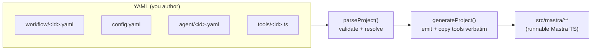
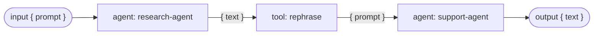
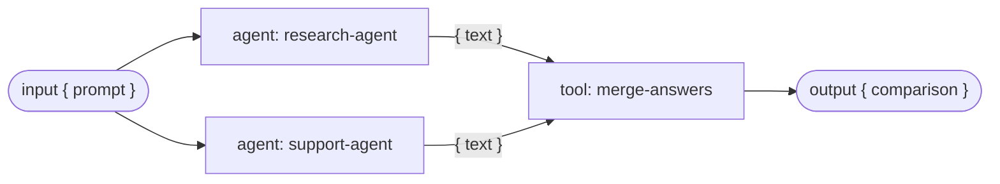

# Workflows — Design (v1, minimal)

**Date:** 2026-06-14 (rescoped 2026-06-17)
**Feature:** Workflows for the YAML Agent Builder (roadmap #15)
**Status:** implemented (v1) — sequential + parallel + agent attachment + custom `step/` resource; fuller control flow (loops/`foreach`/`branch`/conditions) still deferred (see end)

---

## v1 scope (this milestone)

**In:**
- Workflows defined in `workflow/<id>.yaml` (a flat file, mirroring `agent/<id>.yaml`).
- Step kinds: **`agent: <id>`**, **`tool: <id>`**, and **`step: <id>`** (a custom author-as-code
  `step/<id>.ts`, copied verbatim like tools and used directly in the chain — see "Custom `step/`
  resource" below).
- Composition: **sequential** (`.then`) and **parallel** (`.parallel`) only.
- Workflow `input`/`output` via YAML→Zod (primitives).
- Workflows registered on the Mastra instance via `config.yaml → workflows: [<id>]`.
- **Agent attachment** via `agent.workflows: [<id>]` → `new Agent({ workflows })`. **Cycles are
  allowed**: when an attached workflow runs the attaching agent (directly or transitively), the
  `workflows` field is emitted as a lazy thunk off the Mastra instance
  (`workflows: ({ mastra }) => ({ compareAnswers: mastra!.getWorkflow("compareAnswers") })`) to
  avoid an agent⇄workflow static import cycle. Acyclic attachments use a plain static import + object.

**Deferred** (all researched + engine-verified — see "Deferred" at the end): `schema/` escape
hatch, `branch` / `loop` / `foreach`, conditions (`when:`/`when_step:`), and human-in-the-loop
(suspend/resume).

> **Why this is expressive:** **tools and steps are the glue.** A tool/step has arbitrary in/out
> schemas, so it does the `{text}→{prompt}` reshaping between agents and the merge after a parallel
> block. Agents do the LLM work; tools/steps shape and combine. Prefer a `step:` when you want the
> reshaping's `execute` type-checked (`inputData` is inferred from `inputSchema`); a glue `tool:`'s
> `execute` is typed `any`.



---

## The model

- **`workflow/<id>.yaml`** — declarative graph; the filename is the id (→ camelCase export).
- **`config.yaml → workflows: [<id>]`** — registers each workflow on `new Mastra({ workflows })`.
- A step is exactly one of: `agent: <id>` · `tool: <id>` · `parallel: [<agent|tool>, …]`.
- `agent:`/`tool:` reference the project's existing top-level `agent/<id>.yaml` / `tools/<id>.ts`.

### Input layout

```
config.yaml              # workflows: [research-flow, compare-answers]
agent/   research-agent.yaml  support-agent.yaml
model/   gpt-5-mini.yaml
prompt/  research-prompt.md   support-prompt.md
tools/   rephrase.ts          merge-answers.ts      # tools double as glue / merge
workflow/
  research-flow.yaml          # sequential
  compare-answers.yaml        # parallel
```

### How steps map to Mastra (verified @mastra/core@1.42)

- `createStep(agent)` — agent step: input `{ prompt }` → output `{ text }`, step id = agent id (`workflow.d.ts:56`).
- `createStep(tool)` — tool step: uses the tool's own `inputSchema`/`outputSchema` (`workflow.d.ts:83`).
- `.then(step)` — sequential; each step sees the previous step's output.
- `.parallel([steps])` — all run at once on the **same** input; output is **one object keyed by step id**.
- `.commit()` — finalize.

---

## Example 1 — sequential (`workflow/research-flow.yaml`)

Research a question, reshape the notes with a tool, then have support answer.



```yaml
name: Research Flow
description: Research a question, then have the support agent answer from the notes.
input:  { prompt: string }     # matches an agent step's input shape directly
output: { text: string }       # matches an agent step's output shape directly
steps:
  - agent: research-agent      # { prompt } -> { text }
  - tool:  rephrase            # { text }  -> { prompt }   (glue tool)
  - agent: support-agent       # { prompt } -> { text }
```

**Generated — `src/mastra/workflows/research-flow.ts`:**

```ts
import { createWorkflow, createStep } from '@mastra/core/workflows';
import { z } from 'zod';
import { researchAgent } from '../agents/research-agent';
import { supportAgent } from '../agents/support-agent';
import { rephrase } from '../tools/rephrase';

export const researchFlow = createWorkflow({
  id: 'research-flow',
  inputSchema: z.object({ prompt: z.string() }),
  outputSchema: z.object({ text: z.string() }),
})
  .then(createStep(researchAgent))
  .then(createStep(rephrase))
  .then(createStep(supportAgent))
  .commit();
```

**The glue tool — `tools/rephrase.ts`** (an ordinary tool; copied verbatim):

```ts
import { createTool } from '@mastra/core/tools';
import { z } from 'zod';

export const rephrase = createTool({
  id: 'rephrase',
  description: 'Turn research notes into a prompt for the support agent.',
  inputSchema: z.object({ text: z.string() }),
  outputSchema: z.object({ prompt: z.string() }),
  execute: async (inputData) => ({
    prompt: `Using these research notes, answer the user clearly:\n\n${inputData.text}`,
  }),
});
```

---

## Example 2 — parallel (`workflow/compare-answers.yaml`)

Ask both agents the same question at once, then merge with a tool.



```yaml
name: Compare Answers
description: Ask the research and support agents the same question in parallel, then merge.
input:  { prompt: string }
output: { comparison: string }
steps:
  - parallel:
      - agent: research-agent    # both receive the same { prompt }
      - agent: support-agent
  - tool: merge-answers          # keyed-by-step-id input -> { comparison }
```

**Generated — `src/mastra/workflows/compare-answers.ts`:**

```ts
import { createWorkflow, createStep } from '@mastra/core/workflows';
import { z } from 'zod';
import { researchAgent } from '../agents/research-agent';
import { supportAgent } from '../agents/support-agent';
import { mergeAnswers } from '../tools/merge-answers';

export const compareAnswers = createWorkflow({
  id: 'compare-answers',
  inputSchema: z.object({ prompt: z.string() }),
  outputSchema: z.object({ comparison: z.string() }),
})
  .parallel([createStep(researchAgent), createStep(supportAgent)])
  .then(createStep(mergeAnswers))
  .commit();
```

**The merge tool — `tools/merge-answers.ts`.** After `.parallel([...])` the input is one object
**keyed by each step's id**, so the tool's `inputSchema` mirrors that shape:

```ts
import { createTool } from '@mastra/core/tools';
import { z } from 'zod';

export const mergeAnswers = createTool({
  id: 'merge-answers',
  description: 'Combine the research and support answers into one comparison.',
  inputSchema: z.object({
    'research-agent': z.object({ text: z.string() }),   // keyed by each parallel step's id
    'support-agent':  z.object({ text: z.string() }),
  }),
  outputSchema: z.object({ comparison: z.string() }),
  execute: async (inputData) => ({
    comparison: [
      `Research: ${inputData['research-agent'].text}`,
      `Support:  ${inputData['support-agent'].text}`,
    ].join('\n\n'),
  }),
});
```

---

## Registration — `config.yaml` → `src/mastra/index.ts`

```yaml
# config.yaml
agents:    [research-agent, support-agent]
workflows: [research-flow, compare-answers]    # NEW — registered on the Mastra instance
```
```ts
// src/mastra/index.ts (generated)
import { researchFlow } from './workflows/research-flow';
import { compareAnswers } from './workflows/compare-answers';

export const mastra = new Mastra({
  agents: { researchAgent, supportAgent },
  workflows: { researchFlow, compareAnswers },   // NEW
  // …storage, logger…
});
```

---

## Schemas — YAML→Zod (primitives only)

`input`/`output` accept a flat object of primitives:

| YAML | Zod |
|---|---|
| `prompt: string` | `z.string()` |
| `count: number` | `z.number()` |
| `done: boolean` | `z.boolean()` |
| `mode: [fast, deep]` | `z.enum(['fast','deep'])` |
| `tags: string[]` | `z.array(z.string())` |
| `note: string?` | `z.string().optional()` |

Nested/complex IO → out of v1 (the deferred `schema/` escape hatch). Keep workflow IO simple, or
shape it with a glue tool.

---

## Validation (aggregated into one `ParseError`)

- Workflow listed in `config.workflows` but no `workflow/<id>.yaml` → error.
- A step ref doesn't resolve: `agent:` not in `config.agents`; `tool:` no `tools/<id>.ts` → error.
- A `parallel` block with fewer than 2 children → error (use a plain step instead).
- A step node with more than one of `agent`/`tool`/`parallel`, or none → error.
- Export-name collisions: workflow ids at the registry scope; a workflow's referenced
  agents/tools at that workflow module's scope — extending the existing collision check.
- **Data-flow types are NOT checked at parse time** — step-to-step shape mismatches surface when
  `tsc` runs on the generated project (consistent with the existing "typecheck the output" approach).
- The generated `tsconfig.json` is **fully strict** (`strict: true`, incl. `strictFunctionTypes`).
  > **Superseded (was: `strictFunctionTypes: false`).** That flag was originally disabled because
  > `@mastra/core@1.42` typed `createStep(agent)` so its `execute` (`{ prompt }` input) was rejected
  > contravariantly in every `.then()` chain — and it gave no real IO checking either way.
  > **`@mastra/core@1.43` retyped `createStep`/`.then`/`.parallel`**: valid agent-step chains compile
  > under full strict AND adjacent step IO mismatches now fail `tsc` (not just at runtime). So the
  > pinned core is `^1.43`, the flag override is gone, and a post-`parallel` merge step must type its
  > input as `z.record(z.string(), <commonChildOutput>)` (Mastra types parallel output as a record).
  > The workflow's declared `outputSchema` is still not enforced against the last step (runtime/manual).

---

## Codegen touchpoints & build order

1. **Schema + parser** — `WorkflowSchema` (name/description/input/output/steps); a YAML→Zod
   compiler for primitive object schemas; resolve `workflow/<id>.yaml`, validate agent/tool refs,
   resolve export names. New `ResolvedWorkflow` type + `ParsedProject.workflows`.
2. **Emit + register** — `emit-workflow.ts` (imports + `createWorkflow().then()/.parallel().commit()`);
   register in `emit-mastra.ts` (`workflows: { … }`). **Copy workflow-referenced tools** into
   `src/mastra/tools/` (extend `generate.ts`'s tool-copy set — today it only copies per-agent tools;
   a workflow-only tool like `rephrase`/`merge-answers` must be copied too, deduped with agent tools).
3. **Example + docs + tests** — golden-file `emitWorkflow` tests (sequential + parallel), parser
   tests (missing ref, bad parallel), `gen:example` integration + typecheck the output.

Each step is independently shippable and tested, matching parser / codegen / memory / sub-agents.

---

## Deferred (post-v1) — researched & verified, intentionally out

Kept here as the roadmap for the next increments (all checked against @mastra/core@1.42):

- ~~**Custom `step/` resource**~~ — **SHIPPED** (2026-06-17). Author-as-code `step/<id>.ts`
  (`createStep({...})`), referenced via a `step:` leaf, copied verbatim into
  `src/mastra/workflows/steps/<id>.ts` and used directly in the chain (no `createStep` wrapper). Its
  `execute` input is typed from `inputSchema` — a typed alternative to glue tools. See
  `plans/2026-06-17-workflow-steps.md` and `website/docs/reference/step.md`.
- **`schema/` escape hatch** — `.ts` Zod schema for IO too complex for YAML→Zod.
- **Loops + condition resource** — a `loop:` step kind emitting `.dountil`/`.dowhile`/`.foreach`,
  backed by a `workflow/condition/<id>.ts` predicate file (copied verbatim like `tools/`):
  `until:`→`.dountil`, `while:`→`.dowhile`, `foreach: true`→`.foreach`, optional `max_iterations`
  guard. **Engine note for when this lands:** `LoopConditionFunction` is typed `=> Promise<boolean>`
  (`workflows/step.d.ts:56`), so a bare condition must be `async` (or the emitter must wrap it);
  `foreach`'s "previous step outputs an array" precondition is enforced at the generated project's
  `tsc` (`workflows/workflow.d.ts:213`), not at parse time.
- **`branch`** → `.branch([[cond, step], …])`. **Engine-verified:** runs **all** truthy arms
  concurrently (not "first match" as the prose docs say — `chunk-TRXIXO5J.js:4327`). An `else`
  would compile to the negation of all siblings. (A `workflow/condition/<id>.ts` resource would be the
  natural building block for `branch` arms.)
- **`when_step:` predicate-by-step** — a deferred *branch* condition mechanism; distinct from the
  (also deferred) loop `workflow/condition/` resource.
- **Human-in-the-loop** — a suspending step (`suspendSchema`/`resumeSchema` + `suspend()`); run
  pauses with `status: 'suspended'`, resumed via `run.resume(...)`. Needs storage. No new YAML —
  it's a property of a (deferred) custom step.

---

## References

Official Mastra docs (cross-checked against installed `@mastra/core@1.42`):

- Overview — <https://mastra.ai/docs/workflows/overview>
- Control flow — <https://mastra.ai/docs/workflows/control-flow>
- Using with agents & tools — <https://mastra.ai/docs/workflows/using-with-agents-and-tools>
